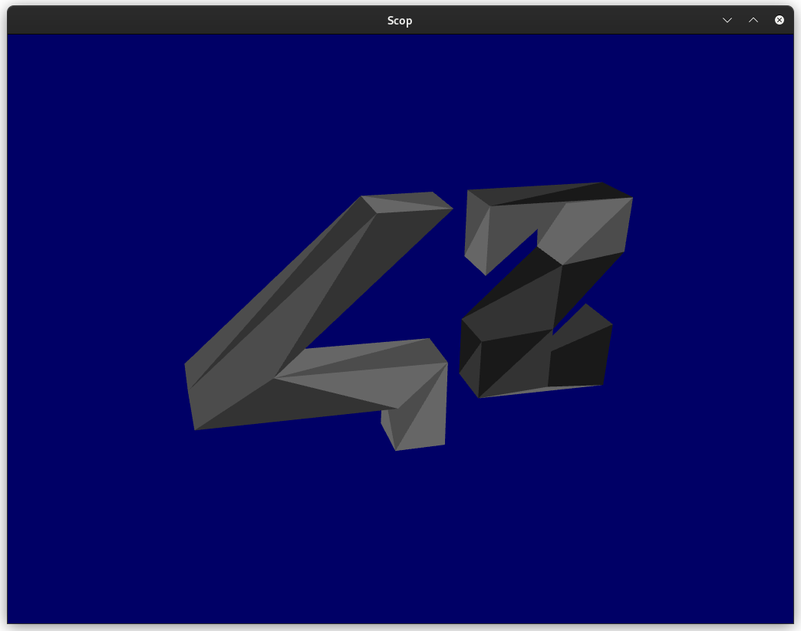
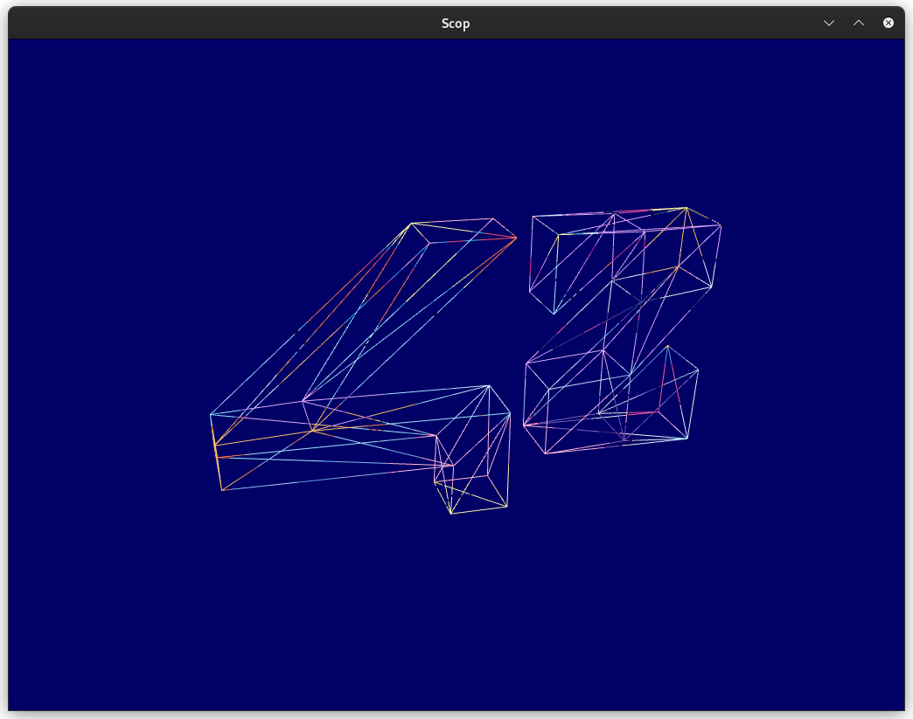
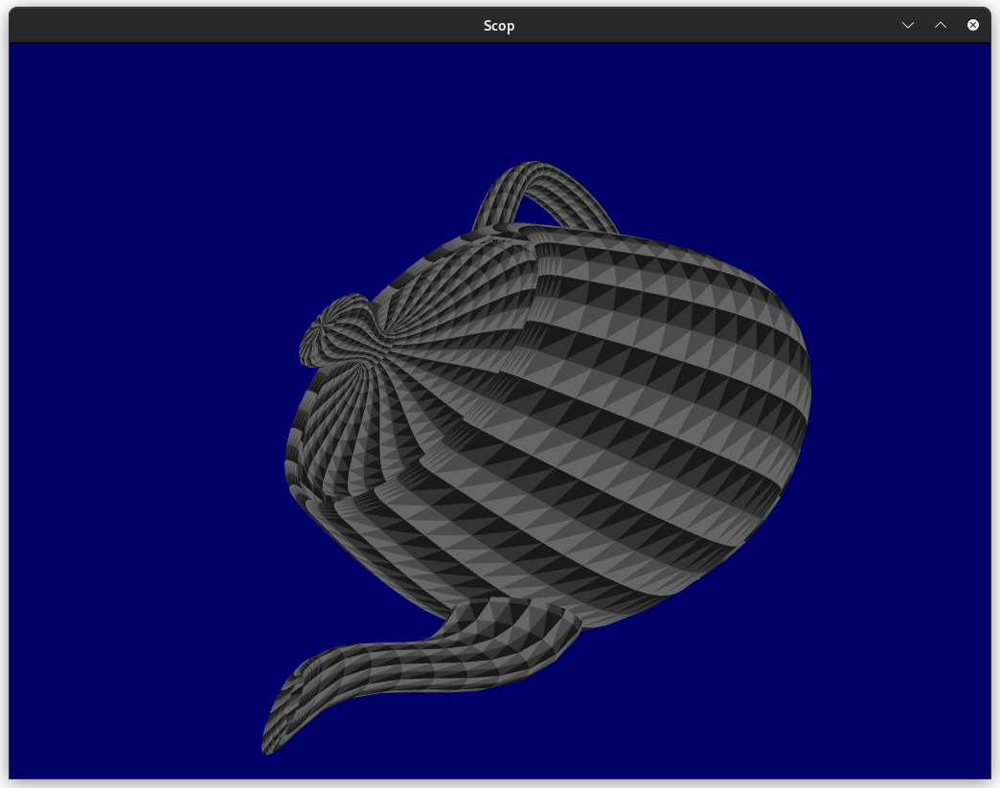
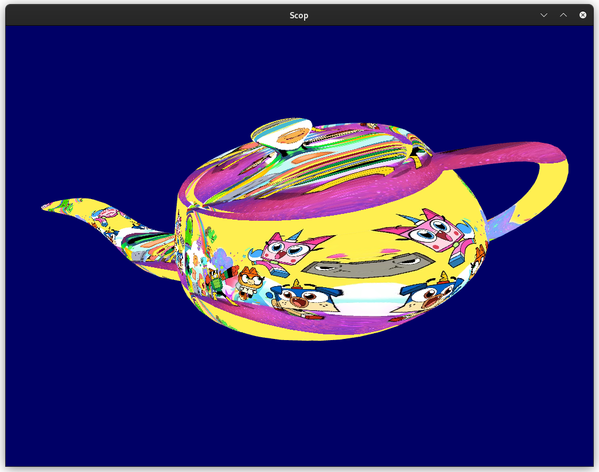
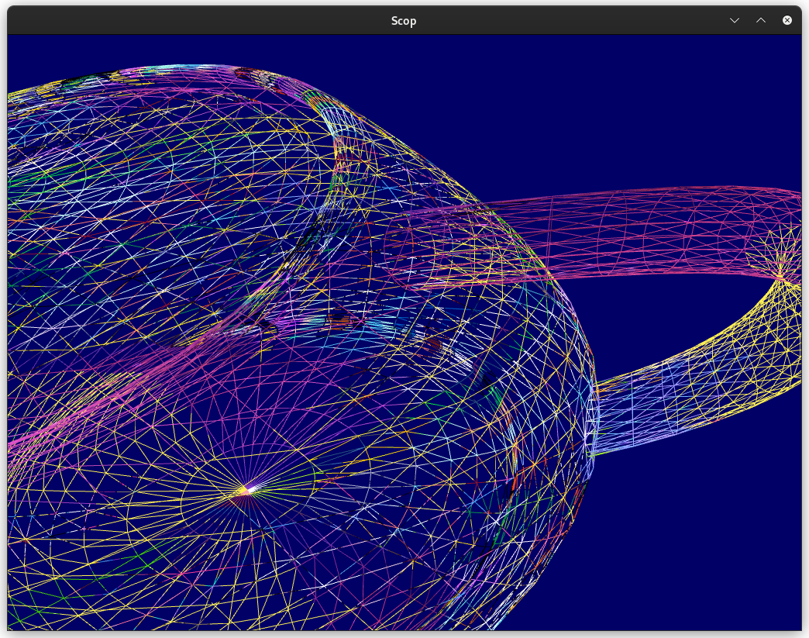
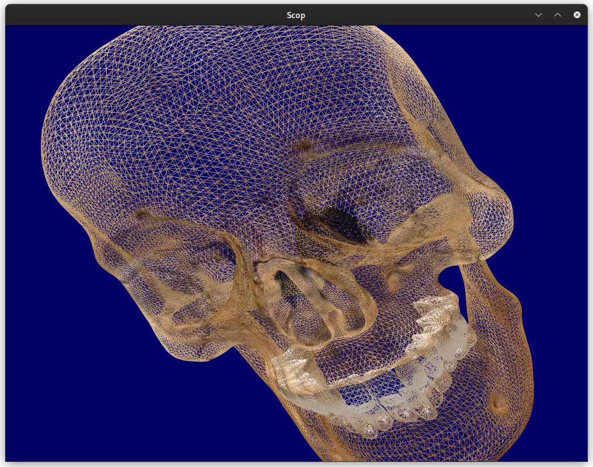
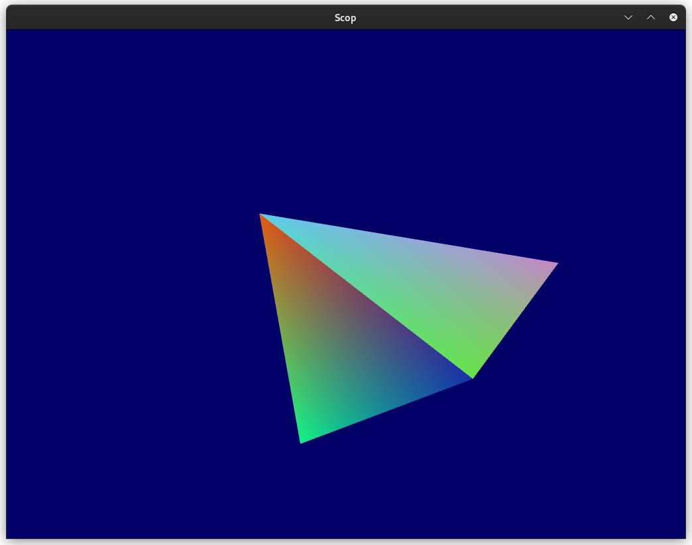
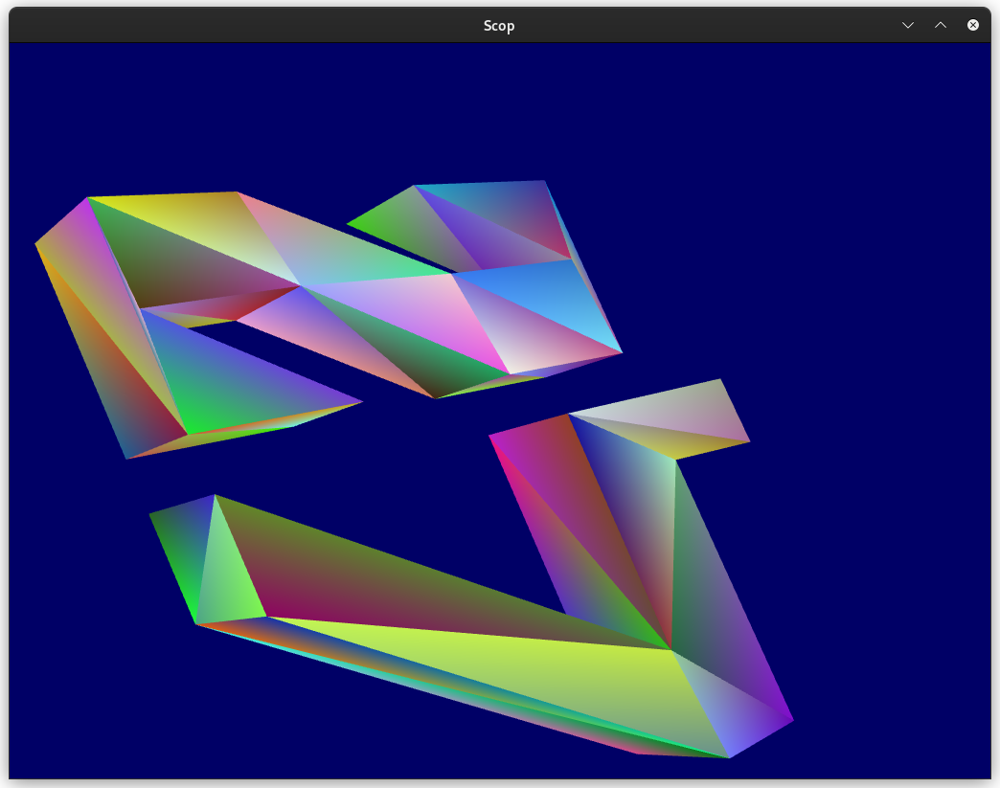
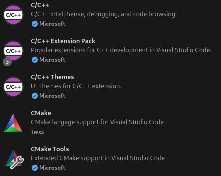
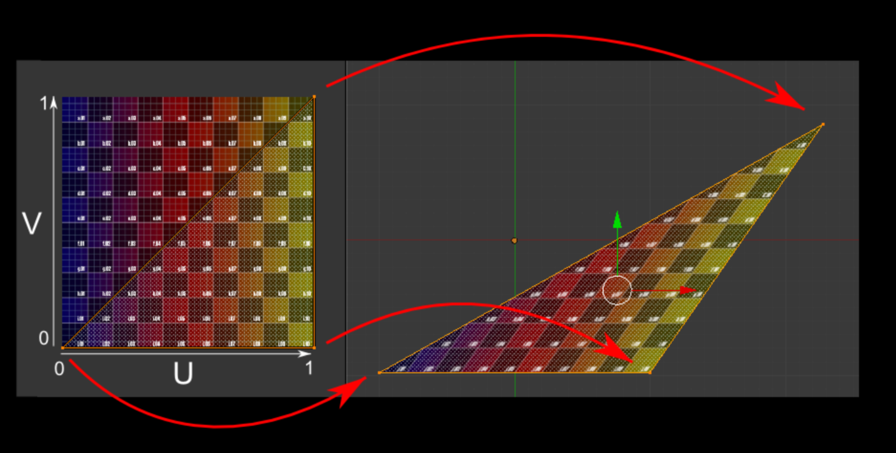

# SCOP

> Learning basics of graphic programming using **`openGL`** library and **C++**

## How use project

### **Launch**  
Easy launch typing `make` command in terminal.  
The Makefile will call `CMake` commands to build the ``C++`` project.  

### **Commands**

Keyboard key | Feature
---| ---
W / ⬆️ | Move object increasing **Y** axis
S / ⬇️ | Move object discreasing **Y** axis
D / ➡️ | Move object increasing **X** axis
A / ⬅️ | Move object discreasing **X** axis
V | Move object increasing **Z** axis
C | Move object discreasing **Z** axis
**Modifiers** | 
Shift | Hold on to inscrease the `move speed` and camera `zoom speed`
Alt | Hold on to `rotate` along **X**, **Y** or **Z** axis instead of `moving`
**Modes** | --- 
T | Enable ``texture`` mode
Y | Enable ``color`` mode
SPACE | Pause or resume ``autorotation``
**Num. pad** | 
/ | Switch to ``wireframe`` triangles
\* | Switch to ``filled`` triangles
\+ | Zoom in using ``camera``
\- | Zoom out using ``camera``
0-9 | Select ``rotation speed``
**A bit more** |  
`make color` | use the command to compile project with random ``colors`` instead of ``grayscale``
ESC | To close window and exit program

### **Screenshots**

< | >
---| ---
 |
 |
 |
 |


## Workspace setup

**GLFW**  
GLFW is an Open Source, multi-platform library for **OpenGL**, **OpenGL ES** and **Vulkan** development on the desktop. It provides a simple API for creating windows, contexts and surfaces, receiving input and events.  
[GLFW .org](https://www.glfw.org/)  

**GLAD**  
GLAD simplifies the process of managing OpenGL function pointers. It generates platform-specific code for loading OpenGL functions, making it easier to use OpenGL in a cross-platform manner. With GLAD, you can dynamically load the required OpenGL functions at runtime, ensuring compatibility across different platforms and OpenGL versions.  
[https://glad.dav1d.de/](https://glad.dav1d.de/)


[Video : Setting up an OpenGL Project in Ubuntu [VSCode, GLFW, GLAD, CMake]](https://www.youtube.com/watch?v=LxEFn-cGdE0)  
[Code and Magic video : Setup OpenGL with GLFW and GLAD](https://medium.com/@codeandmagic/getting-started-with-opengl-using-glfw-and-glad-6f9c2b7e683d)

**CMake**  
[https://cmake.org/getting-started/](https://cmake.org/getting-started/)  
[CMake Command line tool Documentation](https://cmake.org/cmake/help/latest/manual/cmake.1.html)  
```
cmake --version (NUC)
cmake version 3.22.1
```

***Install and compile steps***  
1. download glfw-3.4 from [GLFW .org](https://www.glfw.org/)  
2. Get VS Code with C++ extensions and Cmake tools :  
  
3. Open glfw-3.4 folder into VsCode, then use Cmake to **configure** as suggered by Cmake ext and then go insidebuild and use `make` command.  
4. The library and headers path to compile  
```
"... /glfw-3.4/build/src/libglfw3.a"
"... /glfw-3.4/include/GLFW"
```
5. Get glad.c and glad.h files from [https://glad.dav1d.de/](https://glad.dav1d.de/)  


## **Key concepts**  

### **Vertex**  
Part of an array of Numbers, that can be also divided as chunks representing info like : position, texture, color ...  
`Stride` : the length of a vertex, for example sizeof(float) * 2

### **Shadders**
- `vertex shadders` : 1 call by vertex (positions)
- `fragment/pixel shadder` : 1 call by pixel, `rasterization` means fill up with a color  

Shaders are programmed in GLSL : GL Shader Language, which is part of OpenGL.  
compiled at run time, every time you launch your application, all your shaders are recompiled.

> Textfiles to tell how read vertex

### **Index Buffer**

- To not duplicate vertex. Triangles have common points.
- need UNSIGNED int (or even char)
- Clockwise + xy origin at center of window

```cpp
  // a vertex with only position info, his stride(~length) is 2 * sizeof(float)
  float positions[] = {
    -0.5f, -0.5f, // 0
    +0.5f, -0.5f, // 1
    +0.5f, +0.5f, // 2
    -0.5f, +0.5f, // 3  // square => two triangles with two common points
  };

  // to avoid duplicate vertex (save memory), use duplicated indices instead to make indexbuffer
  unsigned int indices[] = { 
    0, 1, 2, // triangle one
    2, 3, 0, // triangle two (Clockwise + xy origin at center of window)
  };

  // Buffer : calibré par rapport au nombre total de points/vertex
  //   2 triangles = 6 points, (les duplicata sont comptés 2x)
  unsigned int buffer;
  glGenBuffers(1, &buffer);
  glBindBuffer(GL_ARRAY_BUFFER, buffer);
  glBufferData(GL_ARRAY_BUFFER, 6 * 2 * sizeof(float), positions, GL_STATIC_DRAW);

  // Index Buffer : calibré par rapport au nombre d'indices (6 unsigned int ici)
  unsigned int indexBuffer;
  glGenBuffers(1, &indexBuffer);
  glBindBuffer(GL_ELEMENT_ARRAY_BUFFER, indexBuffer);
  glBufferData(GL_ELEMENT_ARRAY_BUFFER, 6 * sizeof(unsigned int), indices, GL_STATIC_DRAW);
```

### **Error handling**

Opengl set a flag when error occures. Need clear the flag before test and then use.
The following macro can wrap function calls (care about scope if it not return void)

```cpp
// Error handling -- Breakpoint creation depends on system here is for Linux 
#define ASSERT(x) if (!(x)) raise(SIGTRAP);
#define LOGCHECK(x) clearError();\
  x;\
  ASSERT(noLogCall(#x, __FILE__, __LINE__ ))
/// ...
```

### **Uniforms**

> `u_` prefix for uniform. Used to deal with dynamic data in the shader source files.

into fragment vertex text source :
```cpp
uniform vec4 u_color;
```

Need to be called **after** : `glUseProgram(shader)`
```cpp
  int uLocation = glGetUniformLocation(shader, "u_color");
  // ASSERT(uLocation != -1);
  glUniform4f(uLocation, 0.8f, 0.3f, 0.8f, 1.0f); // here the data is given 
```

### **Vertex Arrays**

**Core(modern) Profile vs Compatibility(legacy) Profile**  
Vertex array are **mandatory**.
Only in **Compatibility** profile a default vertex array is provided.

```cpp
// Go with CORE profile :
  glfwWindowHint(GLFW_CONTEXT_VERSION_MAJOR, 4);
  glfwWindowHint(GLFW_CONTEXT_VERSION_MINOR, 6);
  glfwWindowHint(GLFW_OPENGL_PROFILE, GLFW_OPENGL_CORE_PROFILE);
```
```cpp
  // this line is the one that links the Vertex Array and the index buffer
  // telling to link at layout 0 the actual buffer (more or less) 
  glVertexAttribPointer(0, 2, GL_FLOAT, GL_FALSE, 2 * sizeof(float), 0);

  // [...]

  // order of calls matters (we are in loop here)
  glBindVertexArray(vertexArray); // 1st
  glBindBuffer(GL_ELEMENT_ARRAY_BUFFER, indexBuffer); // 2nd
```

### **Abstract openGl mechnisms into class**

Build up `VertexBuffer` and `IndexBuffer` classes  
Also a `Renderer` class which contains the ASSERT and LOGCHECK macros  
Same with `VertexArray` class and `Shader`  

### **Renderer**

Build class responsible of draw.  
**Advice for later** : Use a `Material` class which will be a `Shader` class + data about **uniforms**  
to abstract and don't use outside rendrerer things like :  

```cpp
  shader.bind();
  shader.setUniform4f("u_color", r, 0.3f, 0.8f, 1.0f);
```

### **Textures**

Texture positions added to vertex.  
Method using UV coordinates



*Shader updated :*

```cpp
#shader vertex
#version 330 core

layout(location = 0) in vec4 position;
layout(location = 1) in vec2 texCoord; // texture float data retreive from position buffer

out vec2 v_texCoord; // out -> to pass to fragment shader

void main()
{
  gl_Position = position;
  v_texCoord = texCoord;
};


#shader fragment
#version 330 core

layout(location = 0) out vec4 color;

in vec2 v_texCoord; // in -> to retreive from vertex shader

uniform vec4 u_color; // will produce a waring if there is still a uniform targeting "u_color"
uniform sampler2D u_texture;

void main()
{
  vec4 texColor = texture(u_texture, v_texCoord); // pick up the color for one pixel into texture
  color = texColor;
};
```

### **Blending**

📐 **Blending**  
&emsp; determines how we **combine** our **output** color with what is already in our **target buffer**.  
📐**Output** &emsp; `source`  
&emsp; the **color** we output from our **fragment shader**.  
📐**Target Buffer** &emsp; `destination`  
&emsp; the buffer our fragment shadder is drawing to.

**CONTROL BLENDING** (3 ways)  

1. `glEnable(GL_BLEND)` - `glDisable(GL_BLEND)`  
2. `glBlendFunc(source, destination)`  
  &emsp; **source** : how the src RGBA factor is computed (default GL_ONE)  
  &emsp; **destination** : how the dest RGBA factor is computed (default GL_ZERO)  
3. `glBlendEquation(mode)`  
  &emsp; **mode** : how we combine the src and dest colors (default GL_FUNC_ADD)  

*So, by default : &emsp;  &emsp;  1 + 0 = 1 --> use source value*  

### **Maths**  

`Matrices`  
Transformation. `Projection matrice`  
*see nicelly illustrated theoric + example in [opengltutorial](https://www.opengl-tutorial.org/beginners-tutorials/tutorial-3-matrices/)*

`Vectors`  
**(x,y,z,w)** vectors  
**direction** vector : **w = 0**  
**position** vector  : **w = 1**  

*using [glm](https://github.com/g-truc/glm) lib - openGL specifiq*


### **Projection Matrice**  

3D world ---> 2D screen
`Normalized` coordinates beetween -1 to +1
`Orthographic` vs `Perspective` projection

### **`M`odel `V`iew `P`rojection matrices**  

**Model matrix** : object's transform (transaction rotation scale TRS)  
**View matrix** : camera position
**Projection matrix**  
---> 3 matrix multiply  

### **Batch rendering**  

regroup several **draw** call in one.

### **Camera, FoV, trigonometrics**  

This is nicely illustrated [here](https://www.opengl-tutorial.org/beginners-tutorials/tutorial-6-keyboard-and-mouse/)


<br/>
<br/>
<br/>
<br/>
<br/>
<br/>
<br/>
<br/>
<br/>
<br/>
<br/>


##  Sources


**The Cherno**  
[The Cherno Youtube OpenGL playlist](https://www.youtube.com/watch?v=W3gAzLwfIP0&list=PLlrATfBNZ98foTJPJ_Ev03o2oq3-GGOS2)  
 (-> [Using Libraries in C++ (Static Linking)](https://www.youtube.com/watch?v=or1dAmUO8k0))  

This site provides a good general explanation what can you do with this project

- [learn OpenGl (doc non officielle)](https://learnopengl.com/Introduction)  
- [Site officiel OpenGl](https://www.opengl.org/)
- [Docs GL](https://docs.gl)
- [hosts the OpenGL specifications and extensions for all OpenGL versions](https://registry.khronos.org/OpenGL/index_gl.php)

**Tutorials series**  
[opengl-tutorial.org](https://www.opengl-tutorial.org/fr/)

stackoverflow :  
Here is good tiny parser for obj https://github.com/syoyo/tinyobjloader  
I found it worthwhile to load a .obj myself [(cpp)](https://github.com/mattkae/MatteEngine/blob/919a9449fb3ead76bc4764ce7dbbfdf35a6a5ece/src/ObjFileLoader.cpp)

**C++ in VS code**
[start c++ project playlist](https://www.youtube.com/playlist?list=PLj6YeMhvp2S7GMkN5kF3lJURo3rduYbyz)  

---

**[ImGui](https://github.com/ocornut/imgui) library**  


**[Building an OpenGL Base Library](https://www.youtube.com/watch?v=cybc6XA1czo)**  
[github source](https://github.com/TheCherno/OpenGL)  
